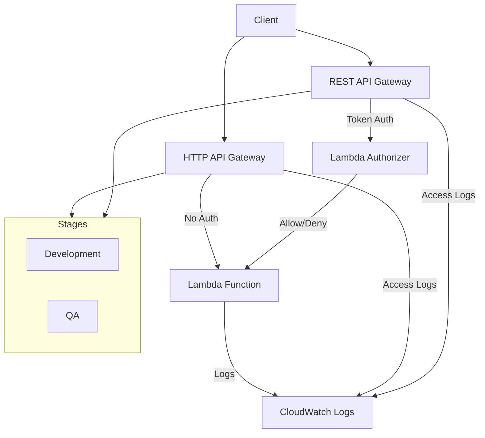
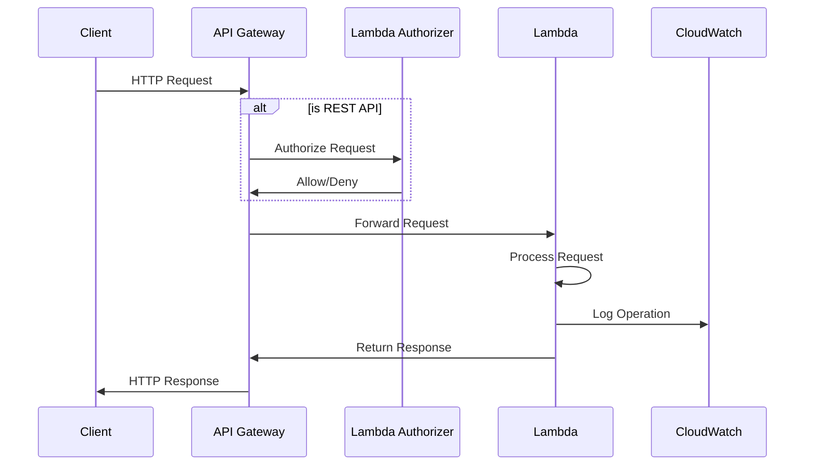

# AWS API Gateway and Lambda Integration POC

This project demonstrates a comprehensive implementation of AWS API Gateway (both HTTP and REST APIs) with Lambda integration, showcasing various enterprise-level features and best practices.

## Architecture Overview



### System Components Interaction



### Components
1. **API Gateway**
   - HTTP API (API Gateway v2)
   - REST API (API Gateway v1)
   - Multiple stages (dev, qa)
   - Custom domain support
   - CORS configuration

2. **Lambda Functions**
   - Main API Handler
   - Lambda Authorizer
   - Environment-specific configurations

3. **Security**
   - Custom Lambda Authorizer
   - IAM Roles and Policies
   - CORS Configuration

4. **Monitoring**
   - CloudWatch Logs
   - Access Logging
   - X-Ray Tracing

### Infrastructure as Code
- Terraform configuration for all AWS resources
- Environment-specific configurations
- Modular design pattern

## Key Features

### 1. Multi-Stage API Deployment
- Separate dev and qa stages
- Stage-specific configurations
- Independent logging for each stage

### 2. API Gateway Implementation
```hcl
# HTTP API (API Gateway v2)
resource "aws_apigatewayv2_api" "HTTP_API" {
  name          = "http-api-${var.environment}"
  protocol_type = "HTTP"
  description   = "HTTP API Gateway for Lambda integration"
}

# REST API (API Gateway v1)
resource "aws_api_gateway_rest_api" "rest_api" {
  name        = "rest-api-${var.environment}"
  description = "REST API Gateway with Lambda integration"
}
```

### 3. Lambda Authorization
```javascript
exports.handler = async (event) => {
    // Custom authorization logic
    const token = event.headers?.Authorization;
    return generatePolicy("user", token === "allow" ? "Allow" : "Deny", event.methodArn);
};
```

### 4. CloudWatch Logging
- Separate log groups for each stage
- Structured logging format
- Retention policies

## Project Structure
```
new-apig/
├── api_gateway.tf        # HTTP API configuration
├── rest_api.tf          # REST API configuration
├── lambda_authorizer.tf # Authorizer configuration
├── variables.tf         # Variable definitions
├── outputs.tf          # Output configurations
└── lambda/
    ├── index.js        # Main Lambda handler
    └── authorizer.js   # Authorizer Lambda
```

## Deployment Steps

1. Initialize Terraform:
```bash
terraform init
```

2. Plan the deployment:
```bash
terraform plan
```

3. Apply the configuration:
```bash
terraform apply
```

## Testing the APIs

### HTTP API
```bash
# Dev Stage
curl https://<api-id>.execute-api.<region>.amazonaws.com/dev/api/test

# QA Stage
curl https://<api-id>.execute-api.<region>.amazonaws.com/qa/api/test
```

### REST API (with Authorization)
```bash
# Dev Stage with valid token
curl -H "Authorization: Bearer allow" \
     https://<api-id>.execute-api.<region>.amazonaws.com/dev/api/test

# QA Stage with valid token
curl -H "Authorization: Bearer allow" \
     https://<api-id>.execute-api.<region>.amazonaws.com/qa/api/test
```

## Advanced Implementation Examples

### 1. Custom Response Handling
```javascript
// Lambda function with custom response handling
exports.handler = async (event) => {
    try {
        // Extract API type from event structure
        const isHttpApi = !!event.requestContext.http;
        
        // Parse request details
        const method = isHttpApi ? event.requestContext.http.method : event.httpMethod;
        const path = isHttpApi ? event.requestContext.http.path : event.path;
        const queryParams = event.queryStringParameters || {};
        
        // Business logic handling
        const response = await handleRequest(method, path, queryParams);
        
        // Error handling
        if (!response.success) {
            return {
                statusCode: 400,
                headers: {
                    "Content-Type": "application/json",
                    "Access-Control-Allow-Origin": "*"
                },
                body: JSON.stringify({
                    error: response.error,
                    requestId: event.requestContext.requestId
                })
            };
        }
        
        // Success response
        return {
            statusCode: 200,
            headers: {
                "Content-Type": "application/json",
                "Access-Control-Allow-Origin": "*"
            },
            body: JSON.stringify({
                data: response.data,
                apiType: isHttpApi ? "HTTP API" : "REST API",
                stage: event.requestContext.stage,
                requestId: event.requestContext.requestId
            })
        };
    } catch (error) {
        console.error("Error:", error);
        return {
            statusCode: 500,
            headers: {
                "Content-Type": "application/json",
                "Access-Control-Allow-Origin": "*"
            },
            body: JSON.stringify({
                error: "Internal Server Error",
                requestId: event.requestContext.requestId
            })
        };
    }
};
```

### 2. Enhanced Authorization
```javascript
// Advanced Lambda Authorizer with caching and JWT validation
const jwt = require('jsonwebtoken');

exports.handler = async (event) => {
    console.log("Auth Event:", JSON.stringify(event));

    try {
        // Extract token
        const token = event.headers?.Authorization?.replace("Bearer ", "");
        if (!token) {
            throw new Error("No token provided");
        }

        // JWT Verification (example using symmetric key)
        const SECRET_KEY = process.env.JWT_SECRET_KEY;
        const decoded = jwt.verify(token, SECRET_KEY);

        // Role-based access control
        const methodArn = event.methodArn;
        const apiGatewayArnParts = methodArn.split(':');
        const apiGatewayArnSlice = apiGatewayArnParts[5].split('/');
        const resource = apiGatewayArnSlice[3];

        // Check permissions based on user role
        const hasAccess = checkRoleAccess(decoded.role, resource);
        if (!hasAccess) {
            throw new Error("Insufficient permissions");
        }

        // Generate policy with custom context
        return generatePolicy(decoded.sub, "Allow", methodArn, {
            userId: decoded.sub,
            role: decoded.role,
            // Custom claims for Lambda function
            custom: decoded.custom
        });
    } catch (error) {
        console.error("Authorization Error:", error);
        return generatePolicy("user", "Deny", event.methodArn);
    }
};

function checkRoleAccess(role, resource) {
    const rolePermissions = {
        admin: ["*"],
        user: ["GET", "POST"],
        readonly: ["GET"]
    };
    return rolePermissions[role]?.includes("*") || 
           rolePermissions[role]?.includes(resource);
}

function generatePolicy(principalId, effect, resource, context = {}) {
    return {
        principalId,
        policyDocument: {
            Version: "2012-10-17",
            Statement: [{
                Action: "execute-api:Invoke",
                Effect: effect,
                Resource: resource
            }]
        },
        context: {
            ...context,
            // Additional useful information
            timestamp: Date.now(),
            env: process.env.ENVIRONMENT
        }
    };
}
```

## Potential Interview Questions

### 1. Architecture and Design
Q: Why did you choose to implement both HTTP API (v2) and REST API (v1)?
> A: This demonstrates understanding of both API types:
> - HTTP API for simpler, cost-effective implementations
> - REST API for advanced features like request/response transformations and complex authorizations
> - HTTP API offers better latency and lower costs
> - REST API provides more features like request validation, API keys, and complex integrations

Q: How does your multi-stage deployment strategy support DevOps practices?
> A: The setup enables:
> - Independent development and testing environments
> - Stage-specific configurations and logging
> - Consistent deployment processes across stages

### 2. Security
Q: Explain your authorization implementation and why you chose this approach.
> A: The implementation uses:
> - Lambda authorizer for flexible, custom authentication
> - Token-based authorization
> - IAM roles and policies for resource access
> - Stage-specific security configurations

Q: How would you handle API keys and rate limiting in this setup?
> A: Could be implemented using:
> - API Gateway usage plans
> - Stage-specific throttling
> - Custom authorizer with rate limiting logic

### 3. Scalability and Performance
Q: How does your architecture handle scaling?
> A: The architecture scales through:
> - Serverless Lambda functions
> - API Gateway's built-in scaling
> - Stage-specific resource allocations

Q: What monitoring and observability features have you implemented?
> A: Implemented features include:
> - CloudWatch logging for each stage
> - Access logging with detailed request/response information
> - X-Ray tracing for REST API
> - Structured log formats for better analysis

### 4. Infrastructure as Code
Q: Explain your Terraform configuration structure and best practices used.
> A: The configuration demonstrates:
> - Modular resource organization
> - Environment-specific configurations
> - Resource tagging strategy
> - Variable management

Q: How would you handle secrets and sensitive information in this setup?
> A: Best practices include:
> - AWS Secrets Manager integration
> - Environment variables for sensitive data
> - IAM roles for access control
> - Terraform workspace management

### 5. Troubleshooting
Q: How would you debug issues in your API Gateway setup?
> A: Troubleshooting approaches include:
> - CloudWatch logs analysis
> - Access log review
> - X-Ray trace analysis
> - Stage-specific logging levels

Q: What are common integration issues between API Gateway and Lambda?
> A: Common issues include:
> - IAM permission configuration
> - CORS setup
> - Timeout settings
> - Payload format version differences

## Best Practices Demonstrated

1. **Security**
   - Custom authorization
   - Principle of least privilege
   - Resource isolation

2. **Monitoring**
   - Comprehensive logging
   - Stage-specific monitoring
   - Structured log formats

3. **Infrastructure as Code**
   - Modular design
   - Environment separation
   - Resource tagging

4. **DevOps**
   - Multi-stage deployment
   - Automated deployment
   - Environment consistency

## Advanced Interview Questions

### 1. Deep Technical Understanding

Q: Explain the difference between Lambda proxy integration and Lambda custom integration in API Gateway.
> A: 
> - **Proxy Integration**: Passes the entire request to Lambda as-is, including headers, query strings, and body. Lambda must return a specific response format.
> - **Custom Integration**: Allows request/response transformation using mapping templates, more control over integration process but requires more configuration.
> - Use proxy for simpler implementations, custom for complex transformations or legacy system integration.

Q: How would you handle different response types (XML, JSON, binary) in your API?
> A:
> - Configure binary media types in API Gateway
> - Use API Gateway response templates
> - Base64 encode binary responses
> - Set appropriate Content-Type headers
> - Handle content negotiation in Lambda

Q: Explain your strategy for API versioning and backward compatibility.
> A:
> - URI versioning (/v1/resource)
> - Custom header versioning (X-API-Version)
> - Content negotiation (Accept header)
> - Stage variables for version routing
> - Maintain multiple Lambda versions

### 2. Performance and Optimization

Q: How would you optimize cold start times for Lambda functions?
> A:
> - Use Provisioned Concurrency
> - Implement Lambda warm-up
> - Optimize function size
> - Choose appropriate runtime
> - Use Lambda SnapStart (Java)

Q: What strategies would you use for implementing caching in this architecture?
> A:
> - API Gateway cache
> - Lambda function caching (external Redis/Memcached)
> - Response header caching strategies
> - Client-side caching headers
> - Consider invalidation strategies

### 3. Security Deep-Dive

Q: How would you implement rate limiting and throttling?
> A:
> - API Gateway usage plans
> - Custom authorizer with rate limiting logic
> - WAF rules
> - Stage-level throttling
> - Account-level throttling

Q: Explain how you would handle sensitive data in your architecture.
> A:
> - AWS Secrets Manager integration
> - KMS encryption
> - Environment variables encryption
> - IAM roles and policies
> - VPC endpoints for private resources

### 4. Monitoring and Troubleshooting

Q: What metrics would you monitor for this system and why?
> A:
> - Latency (p50, p90, p99)
> - Error rates (4xx, 5xx)
> - Integration latency
> - Cache hit/miss rates
> - Throttling events
> - Lambda concurrent executions
> - Lambda error rates and durations

Q: How would you implement distributed tracing?
> A:
> - AWS X-Ray integration
> - Custom trace headers
> - Correlation IDs
> - Structured logging
> - Sampling strategies

### 5. Scaling and High Availability

Q: How would you design this system for multi-region deployment?
> A:
> - Route 53 routing policies
> - Regional API Gateway deployments
> - Cross-region replication
> - Latency-based routing
> - Disaster recovery considerations

Q: What's your strategy for handling downstream service failures?
> A:
> - Circuit breaker pattern
> - Fallback mechanisms
> - Retry strategies
> - Dead letter queues
> - Graceful degradation

## Future Enhancements

1. **Advanced Security Features**
   - WAF integration with custom rules
   - AWS Shield integration
   - Custom authorizer with JWT validation
   - OAuth2 integration
   - mTLS support

2. **Performance Optimizations**
   - Implement API caching
   - Response compression
   - Lambda optimization
   - VPC Link integration
   - Edge optimization

3. **Developer Experience**
   - Custom domain names
   - API documentation (Swagger/OpenAPI)
   - SDK generation
   - Developer portal
   - Postman collections

4. **Quality Assurance**
   - Automated testing suite
   - Integration tests
   - Performance tests
   - Security scans
   - Compliance checks

5. **CI/CD Pipeline**
   - Automated deployments
   - Environment promotion
   - Rollback mechanisms
   - Canary deployments
   - Blue-green deployments

6. **Monitoring and Alerting**
   - Custom CloudWatch dashboards
   - Alert configurations
   - Performance monitoring
   - Cost monitoring
   - Usage analytics

7. **Cost Optimization**
   - Usage plans
   - Throttling rules
   - Caching strategies
   - Resource optimization
   - Cost allocation tags